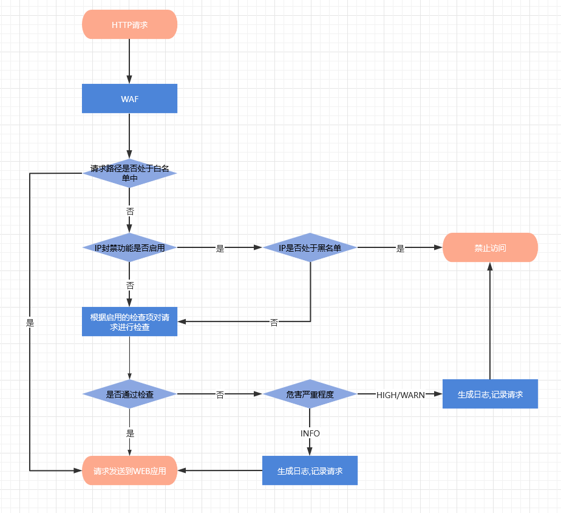

## 流程图



## 检测

### 命令注入&代码注入

检测常见函数

```
file_put_contents
fwrite
exec
passthru
create_function
call_user_func
...
```

检测部分命令

```
whoami
ls
cat
pwd
echo
...
```

检测绕过特征

```
<?php <?=
eval("echo \"hello ".'${${phpinfo()}}'." \";");
echo${IFS}
echo$IFS
\w+\\$\{*\w+
cat</etc/passwd
cat<>/etc/passwd
\w+<>\w+
/b?n/c?t /etc/passwd
\/\w*\?+\w*\/
echo $(whoami)
\\$\(
```

### SQL注入

过滤常用注入手法

```
union select
union[^\xff]+?select[^\xff]+?
updatexml() 或 update操作
update[^\xff]+?\(
extractvalue()
extractvalue[^\xff]+?\(
into dumpfile/outfile
into[^\xff]+?dumpfile
into[^\xff]+?outfile
...
```

过滤常用函数/变量/库

```
load_file[^\xff]+?\(
benchmark[^\xff]+?\(
sleep[^\xff]+?\(
concat[^\xff]+?\(
@@
version[^\xff]+?\(
database[^\xff]+?\(
user[^\xff]+?\(
information_schema\.
mysql\.
sys\.
```

### XSS

```

<[^>]*\s+(?:on|href)\w*\s*=[^`]*(?:top|prompt|alert|confirm)[^`]*\(
<script>/*123*/alert/*123*/('xss')</script>
<[^>]*>[^`]*(?:top|prompt|alert|confirm)[^`]*\(
<svg onload=top["al"+"ert"](1)>
<script src="data:text/html;base64,YWxlcnQoJ3hzcycp"></script>
data伪协议
data:[<MIME-type>][;charset=<encoding>][;base64],<data>
data:
```

### 文件上传监控

后缀白名单&文件内容检测

### 用户操作监控

检测关键词如`admin|login|user`

### 路径穿越,敏感文件读取,PHP伪协议监控

检测关键词如`..|passwd|php://`

## 记录

1. 判断当前访问的路径是否处于路径白名单中

2. 根据监控模块传递的信息生成日志记录并生成原始请求
